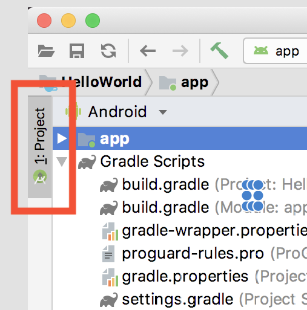

# [アプリの基礎](https://developer.android.com/guide/components/fundamentals?hl=ja)
## Androidの使用言語
AndroidアプリはKotlinやJava、C++言語を使用して記述できます。
- Kotlin
- Java
- C++

## Android SDK
コードをデータやリソースファイルと一緒に**APK(Androidパッケージ)**にコンパイルします。  
これは`.apk`という接尾語の付いたアーカイブファイルです。1つのAPKファイルにAndroidアプリのすべてのコンテンツが含まれており、  
Android端末はアプリをインストールする際にこのファイルを使用します。

書くAndroidアプリはそれぞれのセキュリティサンドボックス内で動作し、以下のAndroidのセキュリティ機能により保護されています。
- 

## LifeCycle
---


## Explore Android Studio
---
Android Studioのソースコードが入っている場所はウインドウの左側にあるProjectタブにある。  
 
  


## アプリのコンポーネント
---


## マニュフェストファイル
---


## アプリのリソース
---


## アーキテクチャ
---
アーキテクチャを直訳すると「建築」や「構造」などの意味があります。  
アプリ開発においてはアプリの設計手法のことを表し、いくつかのパターンがあります。  
これらは先人のエンジニアがよりよいアプリ設計を目指して確立されてきたもので、  
アーキテクチャを適切に導入することで、洗練されたアプリを開発できるようになります。
これより、開発者、ユーザー双方にメリットがあります。

### アーキテクチャの基本概念
1. 関心の分離：役割分担
2. UIをモデルで操作する

#### 1. 関心の分離：役割分担

#### 2. UIをモデルで操作する

### MVP
### MVC
### MVVM
### クリーンアーキテクチャ
### オニオンアーキテクチャ


## UI
---
### Activity
### Fragment
### XML


## memo
---
### 不明単語
- [ ] セキュリティサンドボックス


## INBOX
- [ ] EditTextの内容をクリアにする方法
```Java
EditText editText = findViewById<EditText>(R.id.edit_text_view);
editText.getEditableText().clear();
```
```Kotlin
val editText = findViewById<EditText>(R.id.edit_text_view)
editText.editableText.clear()
```

- [ ] ScrollView  
mainにScrollViewを使うとエラーが発生する

- [ ] Dagger
  - [ ] DIコンテナ

- [ ] DI(Dependency Injection)


### AppCompatActivity
Activityのサブクラス。古いバージョンのAndroidとの下位互換性を提供しながら、最新のAndroidの機能をサポートする。  
可能な限り多くのデバイスとユーザーがアプリを使用するために、常にAppCompatActivityを利用する。

### setContentView() method
実際には整数参照であるR.layout.activity_mainを使用してレイアウトを参照する。

### R class
Rクラスには、resディレクトリのコンテンツを含むすべてのアプリのアセットが含まれる。

## ActionBar
### タイトルを中央揃えにする方法

## BottomNavigationView

## Navigation

## [RecyclerView](https://developer.android.com/guide/topics/ui/layout/recyclerview?hl=ja)
[RecyclerViewのリファレンス](https://developer.android.com/reference/kotlin/androidx/recyclerview/widget/RecyclerView?hl=ja)

依存関係(バージョンはドキュメントを確認)
```build.gradle
dependencies {
    implementation 'androidx.recyclerview:recyclerview:1.1.0'
}
```
  


## [Android Jetpack](https://developer.android.com/jetpack?hl=ja)

## ターミナルにadbのパスを通す(Mac)
ADBとは、「Android Debug Bridge」の略で、Android端末とやりとりするための多用途なコマンドである。アプリのインストールやアンインストール、クラッシュログの出力など、さまざまな操作が行える。
### Android SDK locationを調べる
- Android Studioを起動しSDK Locationを調べる
- 大体、`/Users/ユーザ名/Library/Android/sdk`が初期設定から変更しない場合ある。
  - 現在使用中のMacbookAirの場合は`/Users/takayukishoji/Library/Android/sdk`にある。

### adbコマンドのファイルパスを通す
adbコマンドはsdkフォルダのplatform-toolsにあるので、ファイルパスを通すために下記を追記する。
```
export PATH=$PATH:/Users/ユーザ名/Library/Android/sdk/platform-tools
```
上記を追加する場所は下記コマンドを実行して、設定ファイルを開く。
```
$ open ~/.zshrc
$ vim ~/.zshrc
  または
$ open ~/.bash_profile
$ vim ~/.bash_profile
```
- テキストエディタを選択する場合: open
- vimを選択する場合：vim
  - vimを利用する場合は[vimチートコード](../vimチートコード.md)を参照する。

上記コマンドどちらを選択するかは、下記コマンドを実行しシェルの種類を確認する。
```
echo $SHELL

// 実行結果
/bin/zsh
```

bashの編集後は下記コマンドを実行し、編集内容を反映させる。
```
$ source .zshrc
$ source .bash_profile
$ source .bashrc
```

次に、USBデバッグを有効にした上でUSBケーブルでスマホをつなぎ、下記コマンドを実行するとデバイスがつながっているかを確認できる。
```
$adb devices
```
### adbコマンドでapkをインストールする
```
adb install xxx.apk
```
xxx.apkはapkファイルまでのパスを入れる

### AndroidデバイスでFirebaseDebugViewモードを有効にする方法
ターミナルで`cdコマンド`で下記に移動する。
```
/Users/takayukishoji/Library/Android/sdk/platform-tools
```

下記コマンドを実行することでデバッグモードが有効になる。
```
adb shell setprop debug.firebase.analytics.app <package_name>
```

下記サイトのように記載はされているが、コマンドの実行場所が記載がないため、ぬまる原因になった。2つめのサイトでその原因を知ることになった。
- [イベントのデバッグ](https://firebase.google.com/docs/analytics/debugview?hl=ja)
- [Enable Firebase DebugView mode on an Android device](https://write.agrevolution.in/enable-firebase-debugview-mode-on-an-android-device-a6aa108acb56)

## ソフトキーボードがビューを押し上げないようにする
`AndroidMainfest.xml`に下記を追加する。
```
<activity
   ...
   android:windowSoftInputMode="adjustPan"> 
</activity>
```

## プルダウンの実装
### xmlファイルでSpinnerを実装
```
<Spinner
    android:id="@+id/spinner"
    android:layout_width="wrap_content"
    android:layout_height="wrap_content"
    android:layout_marginStart="100dp"
    android:layout_marginTop="10dp" />
```
### クラスファイルを実装
シンプルにアダプターを利用し、Spinnerでプルダウンを実装すると下記のように記載する。
```
val adapter = ArrayAdapter<String>(this, android.R.layout.simple_spinner_item)
        adapter.setDropDownViewResource(android.R.layout.simple_spinner_dropdown_item)
        adapter.add("A型")
        adapter.add("B型")
        adapter.add("AB型")
        adapter.add("O型")
        val spinner = findViewById(R.id.spinner) as Spinner
        spinner.adapter = adapter
```
アダプターを作る際に`this`を利用しているが、これは`Activity`の場合使える。`Fragment`の場合は`requireContext()`を使用する。
```
val adapter = ArrayAdapter<String>(requireContext(), android.R.layout.simple_spinner_item)
        adapter.setDropDownViewResource(android.R.layout.simple_spinner_dropdown_item)
        adapter.add("A型")
        adapter.add("B型")
        adapter.add("AB型")
        adapter.add("O型")
        val spinner = findViewById(R.id.spinner) as Spinner
        spinner.adapter = adapter
```
Androidのリソースを利用し、プルダウンの選択肢を追加する場合は下記の場所に`arrays.xml`ファイルを作成し、利用する。
```
res > values > arrays.xml
```
```
val serviceUseCountAdapter = ArrayAdapter.createFromResource(this,
            R.array.spinner_array_items, android.R.layout.simple_spinner_dropdown_item)
        val spinner = findViewById(R.id.spinner) as Spinner
        spinner.adapter = adapter
```

## AndroidLayout
### 表示位置
#### ウィジェットの表示位置
**xmlファイルに記載**
`ConstraintLayout`の場合、制約の条件が優先される。
```
// 縦・横どちらも中央に表示する
android:layout_gravity="center"
// 縦のみ中央に表示する
android:layout_gravity="center_vertical"
// 横のみ中央に表示する
android:layout_gravity="center_horizontal"

// 左側に表示
android:layout_gravity="start"
// 右側に表示
android:layout_gravity="end"
// 上側に表示
android:layout_gravity="top"
// 下側に表示
android:layout_gravity="bottom"
```
#### ウィジェット内部の部品の表示位置
```
// 縦・横どちらも中央に表示する
android:gravity="center"
// 縦のみ中央に表示する
android:gravity="center_vertical"
// 横のみ中央に表示する
android:gravity="center_horizontal"

// 左側に表示
android:gravity="start"
// 右側に表示
android:gravity="end"
// 上側に表示
android:gravity="top"
// 下側に表示
android:gravity="bottom"
```

### 表示・非表示
**xmlファイルに記載する場合**
```
// 表示
android:visibility="visible" 
// 非表示（非表示にしたスペースは詰めない）
android:visibility="invisible"
// 非表示（非表示にしたスペースは詰める）
android:visibility="gone" 
```
**ktファイルに記載する場合**
```
// 表示
button.visibility = View.VISIBLE
// 非表示（非表示にしたスペースは詰めない）
button.visibility = View.INVISIBLE
// 非表示（非表示にしたスペースは詰める）
button.visibility = View.GONE
```

### TextView
#### 自動リンク
URLやメールアドレスなどのリンクを自動的に検出してクリック可能なリンクに変換するかどうかを制御する。デフォルト値は「none」で、この機能は無効になっている。
[公式ドキュメント](https://developer.android.com/reference/android/widget/TextView#attr_android:autoLink)
```
// URLリンクの場合
android:autoLink = "web"
```


**メールアドレスリンクをつける**
```
val text_mail = TextView(this)

text_mail.text = "sample@test.com"
Linkify.addLinks(text_mail, Linkify.EMAIL_ADDRESSES)
```
**電話番号リンクをつける**
```
val text_tell = TextView(this)

text_tell.text = "sample@test.com"
Linkify.addLinks(text_tell, Linkify.PHONE_NUMBERS)
```
**URLリンクをつける**
```
val text_url = TextView(this)

text_url.text = "sample@test.com"
Linkify.addLinks(text_url, Linkify.WEB_URLS)
```

### EditTextView
**textの行数を指定する**
```
// 1行のみ表示する
android:maxLines="1"
```
**入力文字数を制限する**
```
// 入力文字数を最大4文字にする
android:maxLength="4"
```
**入力ヒントを表示する**
```
android:hint="password"
```
**EditTextViewのtext省略**
```
// 文字列が枠に収まりきらない場合、文頭を省略
android:ellipsize="start"

// 文字列が枠に収まりきらない場合、中略
android:ellipsize="middle"

// 文字列が枠に収まりきらない場合、末尾を省略
android:ellipsize="end"

// 文字を見切れたまま表示する
android:ellipsize=”none”
```

### フォーカス
#### focusable属性
focusableは、Viewがフォーカスを取得できる（true）・できない（false）を指定する属性。
**xmlファイルに記載する場合**
```
android:focusable="true"
```
**ktファイル上に記載する場合**
```
view.isFocusable = true
```

#### focusableInTouchMode属性
focusableInTouchModeは、Viewをタッチ（スクリーン上でタッチ）することでフォーカスが取得できる（true）・できない（false）を指定する属性。
**xmlファイルに記載する場合**
```
android:focusableInTouchMode="true"
```
**ktファイル上に記載する場合**
```
view.isFocusableInTouchMode = true
```

#### viewがタップされたかどうかを判定する処理
**Activity**
フォーカスが外れたかどうかを判定する。
```
edittext.setOnFocusChangeListener(object : OnFocusChangeListener() {
  fun onFocusChange(v: View, hasFocus: Boolean) {
    if (!hasFocus) {
      //キーボード非表示
      val imm: InputMethodManager =
          getSystemService(INPUT_METHOD_SERVICE) as InputMethodManager
      if (imm != null) {
        imm.hideSoftInputFromWindow(
          v.getWindowToken(),
          InputMethodManager.HIDE_NOT_ALWAYS
        )
      }
    }
  }
})
```
viewがタップされたかどうかを判定する処理
```
override fun onTouchEvent(event: MotionEvent?): Boolean {
        view.requestFocus()
        return super.onTouchEvent(event)
    }
```
**Fragment**
onViewCreatedで下記を記載する。
フォーカスが外れたかどうかを判定する。
```
edittext.setOnFocusChangeListener { v, hasFocus ->
    if (!hasFocus) {
        //キーボード非表示
        val imm = activity?.getSystemService(Context.INPUT_METHOD_SERVICE) as InputMethodManager
        imm.hideSoftInputFromWindow(v.windowToken, InputMethodManager.HIDE_NOT_ALWAYS)
    }
}
```
viewがタップされたかどうかを判定する処理
```
view.setOnTouchListener { v, event ->
  view.requestFocus()
  v?.onTouchEvent(event) ?: true
}
```

## ViewBinding
### View Bindingの有効化
appフォルダ配下の「build.gradle」でView Bindingを有効化する。
```
android {
    // 省略
    
    // ViewBindingのセットアップ
    viewBinding {
        enabled true
    }
}
```

### FragmentでViewBindingを使用する
`onCreate`の前に下記を記載する。
```
class MainFragment : Fragment() {
    private var _binding: FragmentMainBinding? = null
    private val binding get() = _binding

}
```
```
override fun onCreateView(
        inflater: LayoutInflater, container: ViewGroup?,
        savedInstanceState: Bundle?
    ): View? {
        return inflater.inflate(R.layout.monster_detail_fragment, container, false)
        // 上記を削除し、下記に書き換える
        _binding = FragmentMainBinding.inflate(inflater, container, false)
        return binding?.root
    }
```
```
override fun onViewCreated(view: View, savedInstanceState: Bundle?) {
        super.onViewCreated(view, savedInstanceState)

        val alertDialogButton: Button = view.findViewById(R.id.alert_dialog_button)
        // 上記をViewBindingを利用し書き換えた形が下記になる
        binding?.alertDialogButton?.setOnClickListener {

        }
    }
```
```
override fun onDestroy() {
        super.onDestroy()

        // 下記を追加する
        _binding = null
    }
```