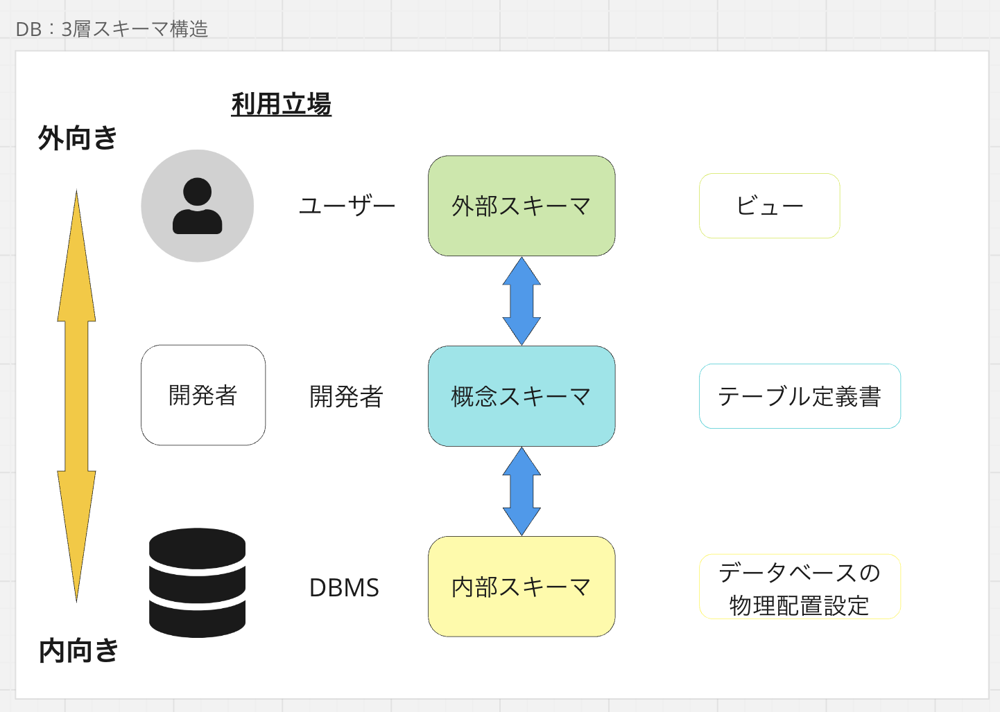
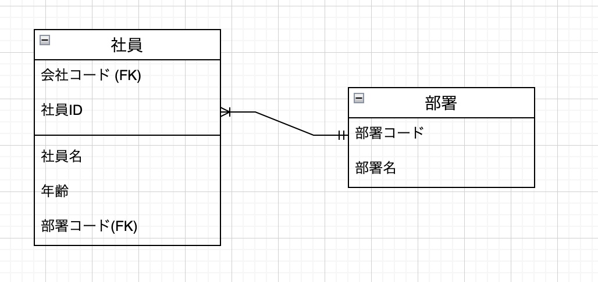

## データベースとは
データを効率的に管理、保存、検索、更新するためのシステム。これにより、大量の情報を整理し、必要なときに迅速にアクセスできるようになる。

### データベースの構成要素
1. データベース管理システム(DBMS)
- データベースの作成、管理、操作を行うためのソフトウェア
- 代表的なDBMS: MySQL, PostgreSQL, Oracle Database, SQL Server, SQLite
2. データベース
- データの集合体
- テーブル、ビュー、インデックス、トリガー、ストアドプロシージャなどのオブジェクトを持つ
3. テーブル
- データを格納するための表。行と列からなる。
- 行: レコード、列: フィールド
4. カラム
- テーブルの列。データ型を持つ。
- データ型: 文字列、数値、日付など
- 主キー、外部キー、ユニークキーなどの制約を設定できる
- インデックスを作成することで検索の高速化が可能

### 主な機能
1. データの保存と管理
- データの追加、更新、削除、検索を効率的に行う
2. データの整合性の維持
- データの一貫性を保つための制約（例：主キー制約、外部キー制約）を提供
3. データのセキュリティ
- データの機密性、完全性、可用性を保護するための機能を提供。データの不正アクセスを防止する
4. トランザクション管理
- 複数のデータ操作を一つの単位として扱い、一貫性を保つ
- [トランザクション.md](./トランザクション.md)
5. バックアップとリカバリ
- データのバックアップを取り、災害などの際にデータを復元する機能を提供

### リレーショナルデータベース(RDB: Relational Database)
RDBはデータベースの中で最も普及している。データを表形式で管理し、テーブル間の関係を定義することができる。
| id  | name | address | 
| --- | ---- | ------- | 
| 1   | 山田 | 東京    | 
| 2   | 鈴木 | 大阪    | 
| 3   | 田中 | 福岡    | 

### 3層スキーマアーキテクチャ
- スキーマとはデータベースの構造を定義するもので、3層スキーマアーキテクチャはデータベースの構造を3つのレベルに分けて管理するアーキテクチャ。
- スキーマを3つに分けることで、データの独立性を高め、データの変更に対する影響を最小限に抑えることができる。
  - あるひとつのスキーマを変更した場合に他の２つのスキーマに影響しないようにすることができる。

下記に3層スキーマアーキテクチャの各レベルを示す。

1. 外部スキーマ
2. 概念スキーマ
3. 内部スキーマ

#### 外部スキーマ
- ユーザーやアプリ側からみたデータベースの構造を定義するスキーマ
- ビューをいじってもデータ格納構造(概念スキーマ)に影響を与えない

#### 概念スキーマ
- 開発者から見たデータベースの構造を定義するスキーマ。データベース全体の構造を定義する。概念スキーマを定義する設計を論理設計と呼ぶ。
- データベース上の論理データ。データベースに保持するデータの要素及びデータ同士の関係を定義する。「テーブル定義書」などに相当する。

#### 内部スキーマ
- データベースの物理的な構造を定義するスキーマ。データベースの物理的な格納方法を定義する。内部スキーマを定義する設計を物理設計と呼ぶ。
- 概念スキーマで定義された論理データを具体的にどのようにDBMS上に格納するかを定義する。「ハードウェア的」な変更はこのスキーマで影響を吸収する。

### 論理設計
概念スキーマを設計すること。データベースの構造を設計する際に、どのようなデータをどのような形式で格納するかを決定する。物理層(CPUやストレージなど)の制約にとらわれない。

論理設計は下記のステップで進める
1. エンティティの抽出
2. エンティティの定義
3. 正規化
4. ER図の作成

#### エンティティの抽出
- エンティティとは、実体を表す
- データベースに格納するデータの単位。例えば、顧客、商品、注文などがエンティティになる。
- 開発においては、システムで扱うデータをエンティティとして抽出することが重要。

#### エンティティの定義
- エンティティがどのようなデータを保持するかを決める。
- エンティティが持つデータを属性(attribute)と呼ぶ。
  - テーブルでいう列に相当する。

例：店舗エンティティには`id`, `name`, `fee`などの属性がある。
| id  |  name  | fee | 
| --- | ------ | --- | 
| 1   | ユニクロ | 300  | 
| 2   | しまむら | 200  | 
| 3   | ZARA   | 500  | 

#### 正規化
正規化はエンティティ(テーブル)がデータを扱いやすい形になるようにデータの構造を整理するプロセス。正規化によりデータの重複を排除し、データの整合性を保つことができる。

#### ER図の作成
ER図はエンティティ同士の関係を図示したもの。エンティティとエンティティ間の関係を明確にすることで、データベースの構造を理解しやすくなる。

### 物理設計
論理設計をもとに、データベースの物理的な構造を設計すること。データベースの性能や拡張性を考慮して、データの格納方法やインデックスの設計を行う。

物理設計は下記のステップで進める
1. テーブルの定義
2. インデックスの定義
3. ハードウェアのサイジング
4. ストレージの冗長構成
5. ファイルの物理的配置

#### テーブルの定義
論理設計で定義したエンティティをテーブルとして実装する。テーブルのカラムのデータ型や制約を設定する。
このフェーズで作成されるモデルを物理もでるという。

#### インデックスの定義
データの検索を高速化するためにインデックスを設定する。インデックスを設定することで、データの検索速度を向上させることができる。

#### ハードウェアのサイジング
データベースを運用するために必要なハードウェアのスペックを決定する。データベースのサイジングを行い、必要なCPU、メモリ、ストレージの容量を計算する。

#### ストレージの冗長構成
データのバックアップや障害対策のために、ストレージの冗長構成を設計する。RAIDやクラスタリングなどの技術を用いて、データの冗長性を確保する。

#### ファイルの物理的配置
データベースファイルをどのようにディスクに配置するかを決定する。適切に配置することで、データベースのパフォーマンスを向上させることができる。
データベースに格納されるファイルは下記の5種類
- データファイル
  - ユーザーがデータベースに格納するデータを保存するファイル
- インデックスファイル
  - データの検索を高速化するためのインデックスを保存するファイル
- システムファイル
  - DBNSの内部管理に使われるデータを管理する
- ログファイル
  - データベースの変更履歴を保存するファイル
- 一時ファイル 
  - 一時的なデータの格納に使われるファイル

開発者はデータファイルとインデックスファイルを意識する必要がある。

### バックアップ設計
障害や災害に備えてデータのバックアップを取ることが重要。バックアップ設計では、バックアップの頻度や方法、リカバリの手順を定義する。

主要なバックアップ方法は下記の3つ
1. フルバックアップ
2. 差分バックアップ
3. 増分バックアップ

#### フルバックアップ
データベース全体をバックアップする方法。データベース全体をバックアップするため、リカバリに時間がかかる。
フルバックアップはシンプルではあるが、下記欠点もある。
- バックアップに時間がかかる
- バックアップファイルのサイズが大きい
- リカバリに時間がかかる
- バックアップの頻度が低い
- バックアップファイルの保存に大容量のストレージが必要
- バックアップファイルの保存場所によってはセキュリティリスクがある
- サービスの停止が必要

#### 差分バックアップ
1回目のフルバックアップ後に変更されたデータだけをバックアップする方法。フルバックアップに比べてバックアップファイルのサイズが小さく、リカバリにかかる時間も短い。

#### 増分バックアップ
差分バックアップの冗長性を省いたものが増分バックアップになる。

## 参考サイト
- [【入門】データベース設計まとめ](https://qiita.com/KNR109/items/5d4a1954f3e8fd8eaae7)