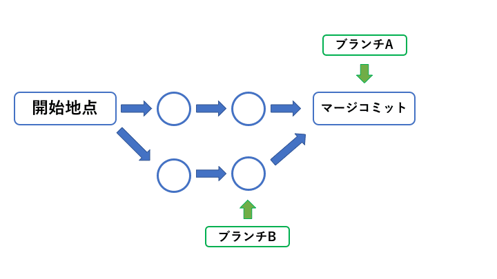

# Gitチートシート
## Gitのユーザー名とメールアドレスを確認・登録する
### 確認コマンド
```
git config user.name  // ユーザー名
git config user.email  // メールアドレス
```
### 登録コマンド
```
git config --global user.name "Your Name"
git config --global user.email "email@～"
```

## コミットを取り消す方法
### ローカルリポジトリの場合は下記のみでOK
```
git reset --hard HEAD^
```
- `--hard`：コミット取り消した上でワークディレクトリの内容も書き換えたい場合に使用。
- `--soft`：ワークディレクトリの内容はそのままでコミットだけを取り消したい場合に使用。
  - 細かくローカルcommitをしているとこのコマンドは多用するようになる。
- `HEAD^`：直前のコミットを意味する。
- `HEAD~{n}` ：n個前のコミットを意味する。
  - `HEAD^`や`HEAD~{n}`の代わりにコミットのハッシュ値を書いても良い。
  - gitのv1.8.5からは、`HEAD`のエイリアスとして`＠`が用意されている。
    - `HEAD~`と`HEAD^`と`@^`は同じ意味。
    - `HEAD^^^`と`HEAD~3`と`HEAD~~~`と`HEAD~{3}`と`@^^^`は同じ意味。

## コミットを取り消す方法
作業ツリーを指定したコミット時点の状態にまで戻し、コミットを行う（コミットをなかったことにはせず、逆向きのコミットをすることで履歴を残す）ためには下記コマンドを叩く。
```
git revert コミットのハッシュ値
```

## コミットの上書きする方法
直前のコミットに上書きするには、下記コマンドを叩く。
```
git commit --amend
```
- コミットメッセージを変更したい時よく使う。
- 「git rebase失敗した時、コンフリクトを避けるためにコミットを上書きする」という使い方もよくする。

### リモートリポジトリにプッシュ済みの場合は上記でローカルを削除したのち下記を実行する。
```
// 強制的にPushする
git push -f origin master
```

## Git管理下でファイル名の変更する方法：git mvコマンド
```
git mv 変更前ファイル名 変更後ファイル名
```
ファイル名を直接変更した場合は別ファイル扱いになってしまう。だから、ファイル名の変更をGitの差分と認識させるためには上記のコマンドを使用する。

## GitHubのリポジトリの種類変更
1. 変更したいリポジトリ画面を開きSettingボタンを押下する
   1. 
2. `Danger Zone`の`Change repository visibility`のボタンを押下する
   1. 
3. 変更したい種類に変更し、リポジトリの名前を記入し決定する
   1. 

## branch削除
```
git branch -d ブランチ名
git branch --delete ブランチ名
```
- このコマンドではマージ済のブランチを削除できる
  - マージされていなかったり作業中のブランチを削除しようとするとエラーが発生する
  - 下記がエラーメッセージ
```
# 作業中
error: Cannot delete branch '削除するブランチ名' checked out at '作業フォルダパス'
# マージされていない
error: Cannot delete the branch 'ブランチ名' which you are currently on
```
- 作業中のブランチを削除する場合は下記コマンドを使用することでどんなローカルブランチも削除できる
```
git branch -D ブランチ名
```
- 削除したいブランチを選択していると削除できない


## Merge
branchAにbrunchBをmergeする場合のコマンド
branchAを選択した状態で下記コマンドを実行する
```
git merge branchB
```


## パスワード求められたが、パスワードでは対応できない場合
### Mac
1. ターミナルでパスワードを求められる操作を行うと下記のようにパスワードを求められる。ここでコロン以下にGitHubのTokenを入力する。
```
Password for 'https://mht-takayuki-shoji@github.com': Tokenを入力
```

