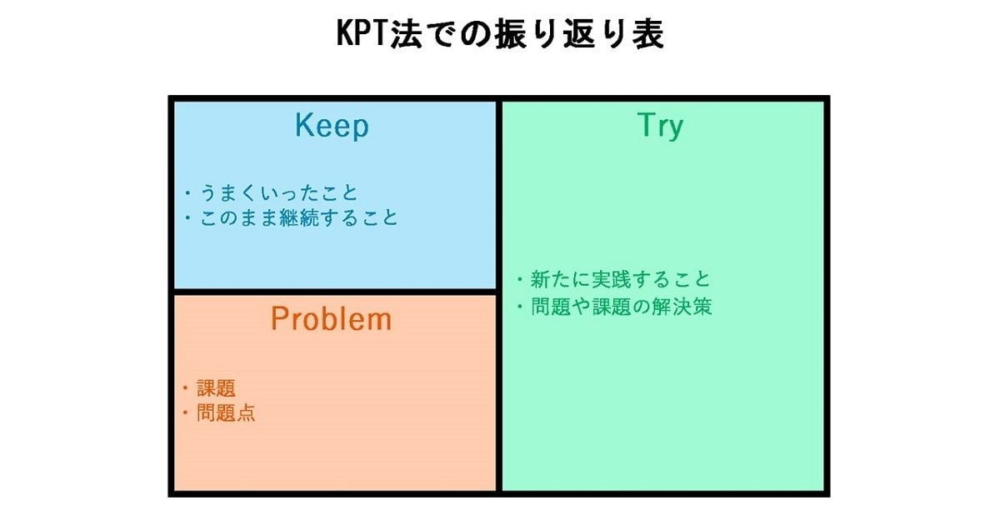

# Windows10
## スクリーンショット
- `PrintScreenキー`：画面全体をスクリーンショットしてクリップボード上に保持
- `Alt + PrintScreen`：現在開いているウインドウをスクリーンショットしてクリップボード上に保持
- `Windows + PrintScreen`：画面全体をスクリーンショットして画像として保存。保存先はピクチャフォルダ
- `Windows + Alt + PrintScreen`：現在開いているウインドウををスクリーンショットして画像として保存。保存先はビデオフォルダ
- `Windows + Alt + S`：範囲を指定してスクリーンショットしてクリップボード上に保持

## 動画撮影
- `Windows + G`でゲームバーを開き、赤枠部のボタンを押下する。もしくは、`Windows + Alt + G`で録画
- 

# コミュニケーション
## RocketChat
- 日本語化
  - マイアカウント>設定>ローカライズから日本を選択する
- Web通知
  - chromeの通知設定を変更
    - 設定>サイト設定>RocketChat>通知を変更する
  - マイアカウント>設定>通知から設定する

# 契約に関して
## 契約した場合に最初に押さえておく情報
- 氏名(会社名)
- 住所
- 勤め先
- 口座番号

## 契約成立の違い
- 日本では両者の合意により契約は成立する
  - 書類の形のない口約束でも契約は成立する
  - 契約書は契約成立後に契約成立を見える化したもの。この場合契約成立後というの肝。
- 英米法の場合
  - 対価(consideration)または証書(deed)の両方あるいはどちらかが必要
  - 契約はサインした時点で成立する。両者の合意時点では契約は未成立。

## TypeScript
- 参考URL
  - [サバイバルTypeScript入門](https://book.yyts.org/)
  - 

## Webサービス
- [CommentScreen](https://commentscreen.com/)
  - 画面共有時にニコニコ動画みたいにコメントを流すサービス

## デザインパターン(design pattern)
### アンチパターン(anti-pattern)

## GraphQL
- GraphQLはFacebookが開発しているクエリ言語
  - クエリ言語とはAPIへの問い合わせ言語
- RESTの代わりになる

## KPT法
KPT法とは、取り組んでいる仕事や活動を改善するための改善するための振り返り方法のひとつ。現状を見直す際に、「keep(このまま継続)」、「Problem(課題)」、「Try(解決策)」という3つの項目「KPT」を書き出し、今後どうするかを考えるもの。シンプルな手法で、ひとりでも集団でも活用でき仕事も仕事以外の取り組みも使える優秀な振り返り方法。  
  
### KPT法の生まれ
- KPT法の原型はアメリカのプログラマである、アリスター・コーバーン氏の発案
  - 『[これだけ！KPT](https://www.amazon.co.jp/gp/product/B00EVHZPS0/ref=ppx_yo_dt_b_d_asin_title_o00?ie=UTF8&psc=1)』を著者、天野勝氏の談
    - 天野氏はアジャイルソフトウェア開発のコンサルタント
- コーバーン氏が提唱した「反省会の出力サンプル（Sample poster from reflection）」
  - この中に「Keep these」「Problems」「Try these」というキーワードが使われており、それがKPT法の起源
- 上記から「Keep」「Problem」「Try」の3つのセクションを使った振り返り術を考案したのが平鍋健児氏。
  - 平鍋健児氏は永和システムマネジメントの代表取締役社長
    - 永和システムマネジメントは上記の本の著者の天野氏が所属する。
  - 平鍋氏は、「コーバーン氏から教えてもらった」というKPT法をアジャイル開発の現場で多用し、2005年にはすでに「KPT法のヘビーユーザー」だと公言している。
  - アジャイル開発においてKPT法は欠かせないもの。スピード感を重視し、短期間での開発を繰り返して改良を重ねるためには、KPT法による改善策の洗い出しが大変効果的
  - 現在では、ほかの業種のプロジェクト運営などはもちろん、仕事以外のチームの能率アップや個人での生活の見直しなど、あらゆるシチュエーションで活用されている

### KPT法による振り返りの手順
1. 下記の図のようにスペースを「Keep」「Problem」「Try」の3つのセクションに分ける。この形しかないというわけではないがこの形が一般的。
2. 「Keep」の欄に「うまくいったこと・このまま継続すること」を書き出す。
3. 「Problem」の欄に「課題・問題点」を書き出す。
4. 「Keep」と「Problem」の内容を受けて、「Try」の欄に「新たに実践すること・問題や課題の解決策」を書き出す。
5. 3つのセクションに書き出したものを再考して整理し、表を完成させる。
6. 「Keep」「Problem」「Try」それぞれで挙がったことを、その後アクションとして実行していき、結果を再度KPT法で振り返る。

- 2回目以降は前回のものを利用し、改良や取捨選択を行う。
- KPT法は定期的に、なおかつなるべく短いスパンで行なったほうがよい。

### KPT法の利点
- 問題を可視化し、客観的に整理できる。
- チーム全員が「Problem」に向き合える。
  - チームの意識が「人」に向くのではなく「問題」に向くことで気兼ねなく話をすることができる。
- 前向きに反省できる
  - 一人で反省すると、失敗やだめな点ばかりを注目してしまいネガティブな気持ちになってしまう。最初に「Keep」を書き出すため、ポジティブな気持ちで振り返りができる。
  - もっとうまくできている自分、つまり「Try」した自分を想像して楽しむのがよい。
### KPT法参考URL
- [最強の振り返りメソッド「KPT法」で、失敗を反省するどころか、長所も希望も見つかった話](https://studyhacker.net/kpt-jissen-hokoku)

## ポモドーロテクニック
- 25分間の作業セッションに、5分間の休憩をはさむ時間管理テクニック。
- 1980年代に当時大学生だったフランチェスコ・シリロにより開発された。

### ポモドーロテクニックの活用方法
1. 今日達成したいタスクを優先度順にリストアップする。
2. タスクを選択し、25分間のポモドーロを開始する。
3. セッション完了後、達成できたことを確認する。
4. 5分間の休憩をとる。
5. 手順2～4を繰り返し、ポモドーロをあと3回行う。
6. 計4回ポモドーロを行ったら、15～30分間の休憩を取る。
7. 上記のサイクルを繰り返しつつ、タスク完了までにかかったポモドーロの回数を記録

# EMBP
- EBPM（エビデンス・ベースト・ポリシー・メイキング。証拠に基づく政策立案）とは、政策の企画をその場限りのエピソードに頼るのではなく、政策目的を明確化したうえで合理的根拠（エビデンス）に基づくものとすることです。
  - 参考：[内閣府におけるEBPMへの取組](https://www.cao.go.jp/others/kichou/ebpm/ebpm.html)

## 参考URL
- https://blog.yt8492.com/entries/aboutthisblog
- 
