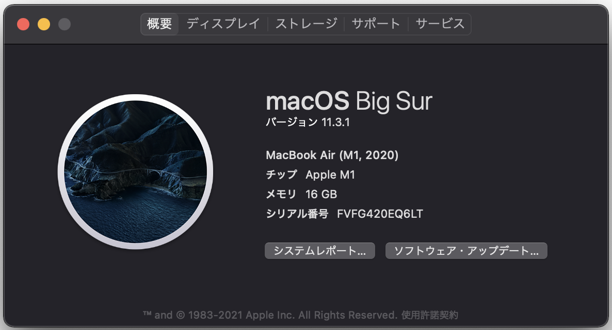
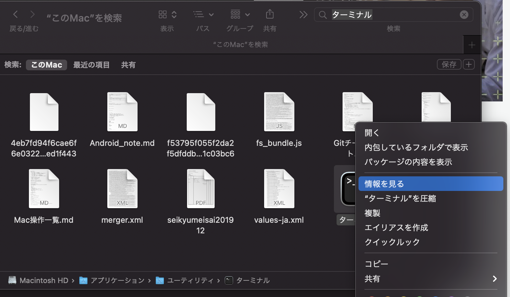
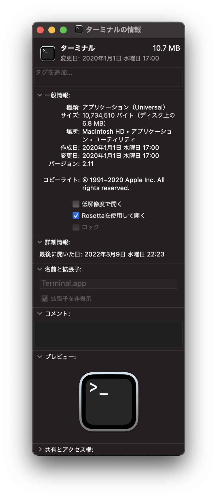

# マシン環境
- マシン
  - M1 MacbookAir 2020
- OS
  - Mac OS Big Sur Ver.11.3.1
- シェル
  - zsh 5.8 (x86_64-apple-darwin20.0)



# ショートカットキー
## スクリーンショット
- 画像ファイルが生成する
  - `Shift + Command + 3`：全画面を撮影する。
  - `Shift + Command + 4`：指定した範囲を撮影する。画像ファイルが生成される。
  - `Shift + Command + 4` → Space：指定したウインドウを撮影する。
- クリップボードに保持する。
  - `Shift + Command + control + 3`：全画面を撮影する。
  - `Shift + Command + control + 4`：指定した範囲を撮影する。
  - `Shift + Command + control + 4` → Space：指定したウインドウを撮影する。

## Finder関連ショートカットキー
- `command + N` : 新規Finderウィンドウを開く
- `command + shift + N` : 新規フォルダ作成
- `command + T` : 新規Finderタブを開く
- `command + O` : Finderを開く

## Finderで隠しファイル、隠しフォルダの表示／非表示
`command + shift + .（コマンド + シフト ＋ ピリオド）`
- 隠しファイルやフォルダの表示と非表示の設定が切り替える。

## Finderでファイルパスを表示
- `option + command + p`

## Finderでファイルパスをコピーする
- `option + command + c`
## [MacでAppを強制的に終了する方法](https://support.apple.com/ja-jp/HT201276)
`option + command + esc`

- Home：`fn + ←`
- End：`fn + →`
- PageUp：`fn + ↑`
- PageDown：`fn + ↓`
- ブラウザ更新：`command + R`
- Finderの検索を表示する：`option + command + space`
- デスクトップを表示する：`fn + F11`
- 強制終了のためのウインドウを開く：`option + command + esc`
- 日本語と英語の入力変換
  - `fn`
  - `control + Space`

## Macの画面をロックする
- `command + control + q`

## Spotlightウインドウを開く/閉じる
- `command + space`

# ターミナル
## コマンド一覧
**CPU(プロセッサ)を調べる**
```
$ sysctl -a machdep.cpu.brand_string

// 実行結果
machdep.cpu.brand_string: Apple M1
```
**IPアドレスを調べる**
```
ifconfig
```
**ホームディレクトリへ移動するコマンド**
```
cd ~
または
cd $home
```

## シェルの種類確認
```
echo $SHELL

// 実行結果
/bin/zsh
```


現在は`zsh`を利用している。

## シェルのバージョン確認
```
zsh --version
または
echo $ZSH_VERSION

// 実行結果
zsh 5.8 (x86_64-apple-darwin20.0)
または
5.8
```

## シェルの編集
下記コマンドを実行して、設定ファイルを開く。
```
$ open ~/.zshrc
$ vim ~/.zshrc
  または
$ open ~/.bash_profile
$ vim ~/.bash_profile
```
- テキストエディタを選択する場合: open
- vimを選択する場合：vim
  - vimを利用する場合は[vimチートコード](../vimチートコード.md)を参照する。

bashの編集後は下記コマンドを実行し、編集内容を反映させる。
```
$ source .zshrc
$ source .bash_profile
$ source .bashrc
```

# brew(Homebrew)
brew(Homebrew)とは、macOS用パッケージマネージャー

## インストール
インストール前の状態でターミナルで `$ berw` コマンドを使用すると下記が表示される。
```
zsh: command not found: brew
```
インストールするには、ターミナル上で以下のコマンドを実行する。
```
/bin/bash -c "$(curl -fsSL https://raw.githubusercontent.com/Homebrew/install/master/install.sh)"
```
インストールの確認方法
```
brew -v

// 実行結果
Homebrew 3.4.1
Homebrew/homebrew-core (git revision 743a3e4c909; last commit 2022-03-09)
```


**M1プロセッサ搭載のMacの場合の対応**
M1プロセッサ搭載の場合は`Rosseta`を使用しインストールを行う。
ターミナルの設定を「Rossetaを使用して開く」に変更するためには下記を実施する。
1. Finderの検索で`ターミナル`と検索をかける
2. ターミナルを右クリックして、「情報を見る」をクリック
3. 「Rosseta使用して開く」（またはRosseta2）左横のチェックボックスにチェックを入れる。
4. ターミナルを再起動する。



