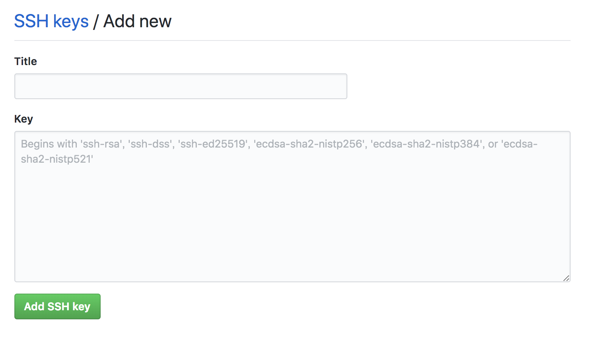

# マシン環境
- マシン
  - M1 MacbookAir 2020
- OS
  - macOS Ventura Ver.13.0.1
- シェル
  - zsh 5.8 (x86_64-apple-darwin20.0)

## 時間環境設定
iOSのシミュレータはMacのシステム時間と同期している。そのためシステム時間を変更することでシミュレータの時間設定も変更できる
**システム環境設定から変更する**
`システム環境設定 > 一般 > 日付と時刻`


# ショートカットキー
## スクリーンショット
- 画像ファイルが生成する
  - `Shift + Command + 3`：全画面を撮影する。
  - `Shift + Command + 4`：指定した範囲を撮影する。画像ファイルが生成される。
  - `Shift + Command + 4` → Space：指定したウインドウを撮影する。
- クリップボードに保持する。
  - `Shift + Command + control + 3`：全画面を撮影する。
  - `Shift + Command + control + 4`：指定した範囲を撮影する。
  - `Shift + Command + control + 4` → Space：指定したウインドウを撮影する。

## Finder関連ショートカットキー
- `command + N` : 新規Finderウィンドウを開く
- `command + shift + N` : 新規フォルダ作成
- `command + T` : 新規Finderタブを開く
- `command + O` : Finderを開く

## Finderで隠しファイル、隠しフォルダの表示／非表示
`command + shift + .（コマンド + シフト ＋ ピリオド）`
- 隠しファイルやフォルダの表示と非表示の設定が切り替える。

## Finderでファイルパスを表示
- `option + command + p`

## Finderでファイルパスをコピーする
- `option + command + c`

## Finderでファイルパスで検索する
- `command + shift + G`

## [MacでAppを強制的に終了する方法](https://support.apple.com/ja-jp/HT201276)
`option + command + esc`

- Home：`fn + ←`
- End：`fn + →`
- PageUp：`fn + ↑`
- PageDown：`fn + ↓`
- ブラウザ更新：`command + R`
- Finderの検索を表示する：`option + command + space`
- デスクトップを表示する：`fn + F11`
- 強制終了のためのウインドウを開く：`option + command + esc`
- 日本語と英語の入力変換
  - `fn`
  - `control + Space`

## Macの画面をロックする
- `command + control + q`

## Spotlighte検索ウインドウを開く/閉じる
- `command + space`

## 画像をFinderから確認する方法(クイックルック)
- 見たい画像を選択して、`space`キーを押す
# ターミナル
## コマンド一覧
**CPU(プロセッサ)を調べる**
```
$ sysctl -a machdep.cpu.brand_string

// 実行結果
machdep.cpu.brand_string: Apple M1
```
**IPアドレスを調べる**
```
ifconfig
```
**現在のディレクトリを表示する**
```
pwd
```
pwdコマンドは「Print Working Directory」または「Present Working Directory」の略と言われる。 
## cdコマンド
**ホームディレクトリへ移動するコマンド**
```
cd ~
または
cd $home
```
**一つ上の階層のファイルに移動する**
```
cd ..
```

## ターミナルでのメッセージとその対応方法
**ターミナルで`quote>`が出てくる理由と対応**
「'」とか「`` ` ``」とかクォート系が1個紛れ込むと、ターミナルは入力が続いてると判断するので、コマンドを打ち切らずに入力を継続させるようになっている
打ち間違いなどの場合は `Ctrl+C`で強制終了させると良い

**`cd: string not in pwd: ディレクトリ名`**
移動先として入力した文字列が現在の作業ディレクトリには無いという意味のエラー。ディレクトリはあるのにこのエラーが発生する場合もあるがその場合は、ディレクトリパスにスペースが入っていることが原因であることが多い。例えば下記のように。
間違い：`cd Application Folder`
対応方法：`cd Application\ Folder` または `cd "Application Folder"`


## シェルの種類確認
```
echo $SHELL

// 実行結果
/bin/zsh
```


現在は`zsh`を利用している。

## シェルのバージョン確認
```
zsh --version
または
echo $ZSH_VERSION

// 実行結果
zsh 5.8 (x86_64-apple-darwin20.0)
または
5.8
```

## シェルの編集
下記コマンドを実行して、設定ファイルを開く。
```
$ open ~/.zshrc
$ vim ~/.zshrc
  または
$ open ~/.bash_profile
$ vim ~/.bash_profile
```
- テキストエディタを選択する場合: open
- vimを選択する場合：vim
  - vimを利用する場合は[vimチートコード](../vimチートコード.md)を参照する。

bashの編集後は下記コマンドを実行し、編集内容を反映させる。
```
$ source .zshrc
$ source .bash_profile
$ source .bashrc
```

## lsコマンド
lsコマンドとは、指定したディレクトリファイルを表示するためのコマンド
```
ls  #カレントディレクトリにあるファイルやディレクトリを表示する
ls -l  #ファイルやディレクトリの詳細も同時に表示する
ls -a  #隠しファイルも含めファイルやディレクトリを全て表示する
ls −la  #隠しファイルを含む全てのファイルやディレクトリの詳細を表示する
```

## mkdirコマンド
新しい空のディレクトリを作る。（make directoryの略）
```
mkdir test #testというファイルを作る
```

## touchコマンド
中身が空のファイルを作成するコマンド
```
touch test.html  #test.htmlという中身が空のファイルを作る
```

## mvコマンド
ファイルやディレクトリの移動や名前の変更を行うコマンド
```
mv test.html tmp/  #test.htmlというファイルを相対パスでtmp/に移動する
mv test.html test2.html  #test.htmlというファイル名をtest2.htmlに変更する
```

## cpコマンド
ファイルやディレクトリのコピーを行うコマンド
```
cp test.html tmp/  #test.htmlというファイルを相対パスでtmp/にコピーする
cp test.html test2.html  #test.htmlをtest2.htmlという名前でコピーする
cp −r dir /tmp/  #dirというディレクトリとその中身を絶対パスで/tmp/にそっくりコピーする
```

## rmコマンド
ファイルやディレクトリの削除を行うコマンド
```
rm test.html  #test.htmlを削除する
rm -r test  #testというディレクトリとその中身を削除する
rm -f test  #testというファイルを警告なしで削除する
rm -rf test  #testというディレクトリとその中身を警告なしで削除する
```

## openコマンド
ファイルやディレクトリを開くコマンド
```
open .  #現在のターミナルのディレクトリFinderで開く
open ~/  #ホームディレトリをFinderで開く
```

## sourceコマンド
設定ファイルを読み込むコマンド
```
source ~/.zshrc  #.zshrcを読み込む
```

## historyコマンド
コマンドの履歴を表示するコマンド
```
history  #コマンドの履歴を表示する
history 10  #最新の10件のコマンドの履歴を表示する
```

## SSHコマンド
SSH(Secure Shell)は、暗号や認証の技術を利用して、安全にリモートコンピュータと通信するためのプロトコル
```
$ ssh [オプション] ホスト名 [コマンド]
```

## SSH
### ディレクトリ、ファイルの存在確認
```
$ ls -l ~/.ssh/config
```
上記コマンドを実行することにより、ssh/configが存在するかどうかを確認することができる。

`~/.ssh`ディレクトリ、`~/.ssh/config`ファイルがない場合は作成する。
### sshディレクトリ作成コマンド
homeディレクトリの直下に.sshディレクトリを作成する。
作成された.sshディレクトリ内にconfigファイルを作成する。
```
$ mkdir ~/.ssh
$ touch ~/.ssh/config
```

### パーミッション設定
```
$ chown -R $(whoami):staff ~/.ssh
$ chmod 700 ~/.ssh
$ chmod -R 600 ~/.ssh/*
```
.sshの権限を700(自分のみ読み書き可能)にする。
.sshディレクトリ内のファイルを600(自分のみ読み書き可能)にする。

### SSHキーの生成
 ```
 % ssh-keygen -t rsa

 // 実行結果
 Generating public/private rsa key pair.
Enter file in which to save the key (/Users/[username]/.ssh/id_rsa): git_work_rsa
Enter passphrase (empty for no passphrase): 
Enter same passphrase again: 
Your identification has been saved in git_work_rsa.
Your public key has been saved in git_work_rsa.pub.
The key fingerprint is:[生成されたkey]
The key's randomart image is:
+---[RSA 3072]----+
|                 |
|                 |
|        .        |
| . o   =         |
|. o . = S        |
|.  + * O         |
|o o O.@E*        |
|oo B.&.X         |
|=o*o=o@==        |
+----[SHA256]-----+

 ```
- 生成キーの名前について
  - 同じ名前のキーがあると、上書きされる
  - `Enter passphrase (empty for no passphrase): `と表示があるところで生成されるkeyの名前を指定できる。
- パスフレーズに関してはあるに越したことはないがなくても生成できる
- SSH認証に使う秘密鍵（id_rsa）と公開鍵（id_rsa.pub）を生成される 

### ホスト共通設定
```
$ open ~/.ssh/config

Host *
  StrictHostKeyChecking no
  UserKnownHostsFile ~/.ssh/known_hosts
  ServerAliveInterval 15
  ServerAliveCountMax 30
  AddKeysToAgent yes
  UseKeychain yes
  IdentitiesOnly yes
```
- `StrictHostKeyChecking no` ホストキーチェック回避
- `UserKnownHostsFile ~/.ssh/known_hosts` ホストキーチェック回避
  - 既知のホストが`~/.ssh/known_hosts`に追加される
- `ServerAliveInterval 15` タイムアウト対
- `ServerAliveCountMax 30` タイムアウト対策
- `AddKeysToAgent yes` 毎回パスフレーズを聞かれてくることに対する対策
- `UseKeychain yes` 毎回パスフレーズを聞かれてくることに対する対策
- `LogLevel QUIET` 警告メッセージを非表示にする
  - `Warning: Permanently added 'github.com,192.30.255.113' (RSA) to the list of known hosts.` このメッセージ。

### GitHubに公開鍵を登録する
**作成した公開鍵をコピーする**
```
$ pbcopy < ~/.ssh/id_rsa.pub
```
**GitHubへアクセスしSSH Keysを登録**
GitHubで「settings」 > 「[SSH and GPG keys](https://github.com/settings/keys)」 > 「New SSH Key」と進み、「Key」項目に公開鍵を貼り付けて「Add SSH key」



### 接続確認
```
$ ssh -T git@github.com
```

### アカウントの切り替え
下記shellコマンドを利用し、切り替えする
そのためのに、`~/.zshrc`ファイルに関数を書く
```
function gitmain() {
  git config --global user.name "[メインのGitHubアカウント名]"
  git config --global user.email "[メインのGitHubのメールアドレス]"
}

function gitsub() {
  git config --global user.name "[メインのGitHubアカウント名]"
  git config --global user.email "[メインのGitHubのメールアドレス]"
}

export PROMPT="
%F{green}[%~]%f <`git config user.name`>
=> %# "
RPROMPT='%*'
```
上記を記載することで下記コマンドを打ち込んで切り替える
```
$ gitmain
$ gitwork
```

# brew(Homebrew)
brew(Homebrew)とは、macOS用パッケージマネージャー

## インストール
インストール前の状態でターミナルで `$ berw` コマンドを使用すると下記が表示される。
```
zsh: command not found: brew
```
インストールするには、ターミナル上で以下のコマンドを実行する。
```
/bin/bash -c "$(curl -fsSL https://raw.githubusercontent.com/Homebrew/install/master/install.sh)"
```
インストールの確認方法
```
brew -v

// 実行結果
Homebrew 3.4.1
Homebrew/homebrew-core (git revision 743a3e4c909; last commit 2022-03-09)
```


**M1プロセッサ搭載のMacの場合の対応**
M1プロセッサ搭載の場合は`Rosseta`を使用しインストールを行う。
ターミナルの設定を「Rossetaを使用して開く」に変更するためには下記を実施する。
1. Finderの検索で`ターミナル`と検索をかける
2. ターミナルを右クリックして、「情報を見る」をクリック
3. 「Rosseta使用して開く」（またはRosseta2）左横のチェックボックスにチェックを入れる。
4. ターミナルを再起動する。


