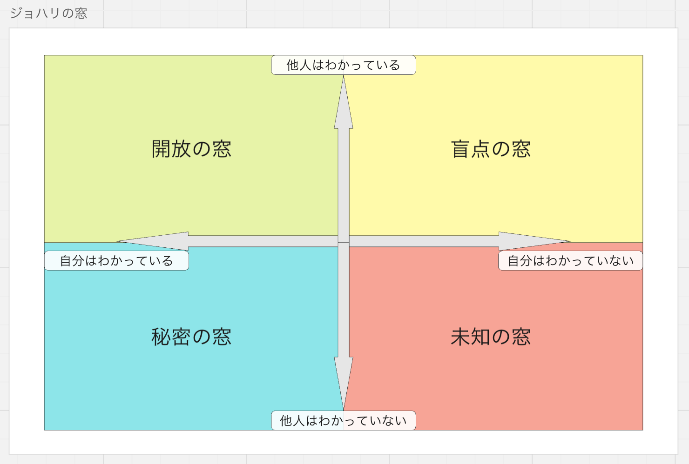

# ジョハリの窓(Johari Window)
　自己分析をおこなう際に使用する心理学モデルのひとつ。「自分から見た自分」と「他人から見た自分」の情報を切りわけて分析することで、自己理解をおこなうというもの。1955年にアメリカのサンフランシスコ州立大学の心理学者ジョセフ・ルフト(Joseph Luft)とハリ・インガム(Harry Ingham)が「対人関係における気づきのグラフモデル」を発表。これが後に、2人の名前を組み合わせた「ジョハリの窓」と呼ばれるようになった。
　心理的なことに限らず、相手との知識とか認識の差異を視覚的に見るためにも使える。

## 4つの窓
1. 開放の窓
　英語でopen selfと訳される「開放の窓」。自分のも他人も知っている自己のこと。開放の窓が大きくなることで、相手に対する親近感や信頼感が高まり、コミュニケーションは円滑化する。

2. 秘密の窓
　英語でhidden selfと訳される「秘密の窓」。自分だけが知っていて、他人にはまだ知られていない自己のこと。わかりやすい例として「トラウマ」や「コンプレックス」があげられる。秘密の窓は小さいほど良いとされ、秘密の窓が大きいということは「隠し事が多い」といえるため、相手に打ち明けて話せない。秘密の窓を小さくしてありのままの自分を見せることで、「開放の窓」が大きくなり、コミュニケーションが円滑になる。

3. 盲点の窓
　英語でblind selfと訳される「盲点の窓」。他人は知っているが、自分では気づいていない自己のこと。わかりやすい例として「思わぬ長所」や「思わぬ指摘」などがあげられる。ときどき「盲点だった…」という言葉を使うように、相手に言われてはじめて気づくケースが多い。

4. 未知の窓
　英語でunknown selfと訳される「未知の窓」。文字どおり、自分と他人も知らない、誰からもまだ知られていない自己のこと。盲点の窓と秘密の窓を小さくして、開放の窓を大きくすると、未知の窓に気づけます。「まだ知らない自分」に気づくことで、自己成長のチャンスが訪れる。

